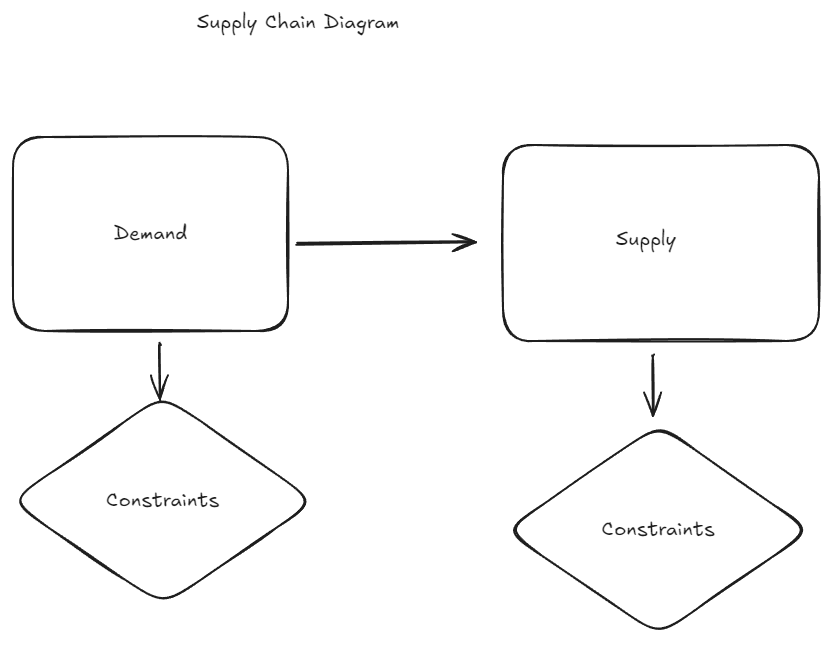

# Design

1. What is a constraint?  Anything that limits or restricts the Demand or Supply side.

2. Constraint Abstraction
   1. Constraint class interface
   2. Human readable naming (including unique ID)
   3. Attributes
