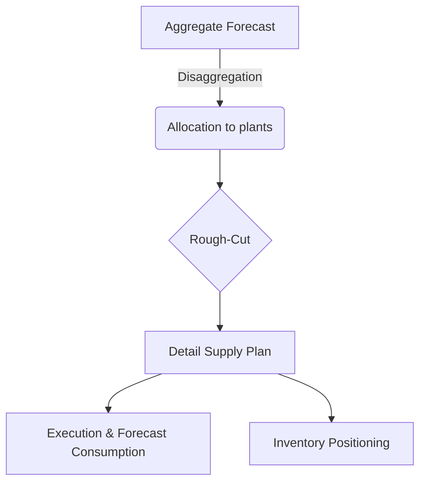

# Introduction
Supply planning data is critical because it provides the foundation for aligning supply chain resources with customer demand. Accurate and timely data on production capacity, inventory levels, lead times, and demand forecasts enables businesses to make informed decisions about what to produce, where to store it, and how to distribute it. Without reliable supply planning data, organizations risk stockouts, excess inventory, higher costs, and poor customer service. By leveraging high-quality data, companies can balance efficiency and resilience, optimize resource utilization, and respond more effectively to market changes.

## Example of Supply Planning DAG

