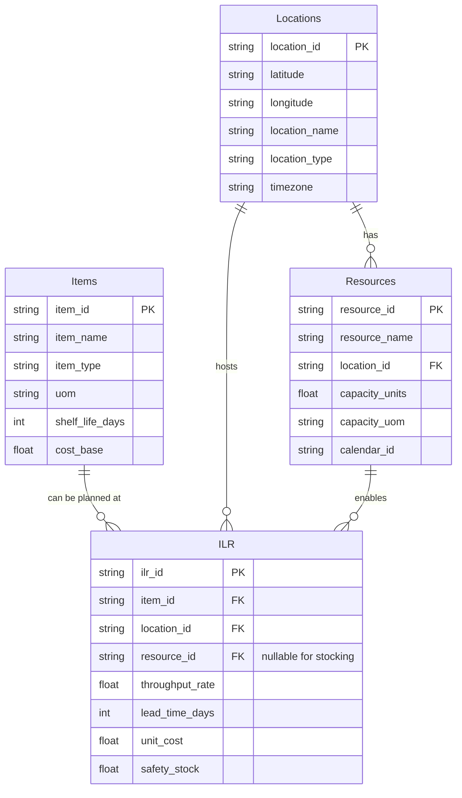

## Resource components and objects
Item - Location - Resource Object model.



# Test - can 2 mermaid charts be posted?


<!-- ```mermaid
erDiagram
  %% Core
  Items ||--o{ ILR : "can be planned at"
  Locations ||--o{ Resources : "has"
  Locations ||--o{ ILR : "hosts"
  Resources ||--o{ ILR : "enables"

  %% Extensions
  Items ||--o{ BOM : "uses"
  Items ||--o{ Demand : "is demanded as"
  Items ||--o{ Inventory : "is stocked as"
  Locations ||--o{ Demand : "demand occurs at"
  Locations ||--o{ Inventory : "inventory stored at"
  Locations ||--o{ Lanes : "ships from/to"
  Calendars ||--o{ Resources : "governs availability"

  %% Tables
  Items {
    string item_id PK
    string item_name
    string item_type
    string uom
  }

  Locations {
    string location_id PK
    string location_name
    string location_type
  }

  Resources {
    string resource_id PK
    string resource_name
    string location_id FK
    float  capacity_units
  }

  ILR {
    string ilr_id PK
    string item_id FK
    string location_id FK
    string resource_id FK
    float  throughput_rate
    int    lead_time_days
    float  unit_cost
  }

  BOM {
    string parent_item_id FK
    string component_item_id FK
    float  quantity_per
  }

  Lanes {
    string lane_id PK
    string source_location_id FK
    string dest_location_id FK
    string item_id FK "optional (can apply to all items)"
    int    lead_time_days
    float  cost_per_unit
    string mode
  }

  Calendars {
    string calendar_id PK
    string description
    string working_days
    string shifts
  }

  Demand {
    string demand_id PK
    string item_id FK
    string location_id FK
    date   period_start
    float  quantity_forecast
  }

  Inventory {
    string inv_id PK
    string item_id FK
    string location_id FK
    date   snapshot_date
    float  on_hand_qty
    float  safety_stock
  }


``` -->
