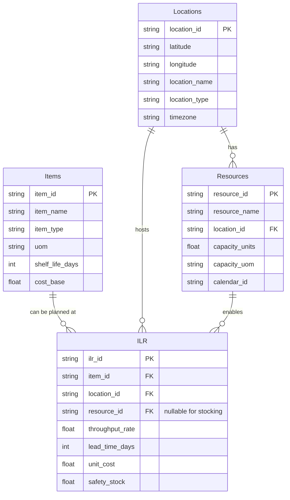

## Resource components and objects
Item - Location - Resource Object model.

# Test - can 2 mermaid charts be posted?
No, 2 Mermaid charts area can't be posted together, no errors get displayed but it doesn't get rendered.

