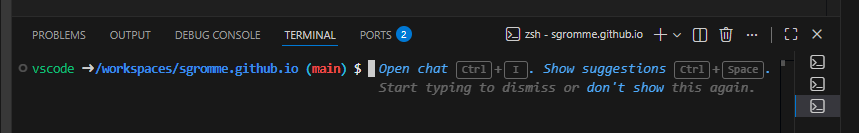

# Command line open chat.

VSC has had Chat as a panel (default on right) for some time.  Now they have the option to add chat to the command line. See appendix for the display when starting a terminal on VSC.

# Appendix

